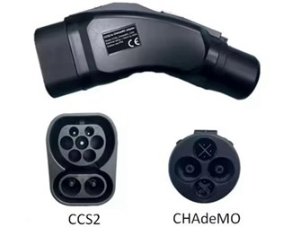

# ccs32clara-chademo

This is ccs32clara derived firmware for Dongguan Longood CCS2 to CHAdeMO adapter (My407ccs2chademo.bin)

## Compatible adapters
The firmware is compatible with the "Dongguan Longgod" adapter variants. If your adapter accepts firmware updates in the form of "My407ccs2chademo.bin" files, it is supported. Note that there are many adapter brands and re-brands on the market.

- Dongguan Longgod ✅ (The original hardware maker)
   - CCS1 US ✅
   - CCS2 EU ✅
- Autonlaturit (rebrand) ✅
- EV-Boy (rebrand) ✅
- Akyga® AK-SC-E18 (rebrand) ✅
- EVniculus (rebrand) ✅
- Electway :x: Not compatible
- A2Z :x: Not compatible
- Orientrise :x: Not compatible
- Feel free to expand this list!

The adapter uses an STM32F407 cpu. It has a bootloader with support for firmware update from USB FAT32, very nice.
It has an internal DC transformator to charge the batteries (pri: 210-1200V DC sec: 12.6V DC 2A). Transformer is connected to the car-side of the adapter.
It has 2 batteries. One short and one long. The long one seems to drive electronics. Guessing the short one drive contactors (one in the adapter itself + 2 in the car).
2 stop buttons, but they are the same GPIO for both.
It has 2 controllable LEDs, one external and one internal (invisible).
It has a QCA7000 powerline modem. It is wired up strangely, so can not use hw spi/dma, must use bitbang.
Some of the voltages are wired up to adc GPIOs. At least the 12v reading does not seem to match with what i measure on eg. Chademo d1 pin.
AFAICS, there are no temperature sensors in the adapter. Ideally there could be sensors at the inlets, or maybe attached to the aluminium conductor bars.

## Operation
Plug adapter into car. Plug cable into adapter. Power on adapter.
Adapter will start chademo to fetch targetVoltage, soc and estimated battery voltage (calculated from targetVoltage and soc).
Chademo will then shut down and ccs logic will start.
When ccs reach start of PreCharge, chademo is restarted. Estimated battery voltage is used as PreCharge target voltage.
When PreCharge reach this voltage, chademo d2 is set. We stall PreCharge and prevent it from completing until car closes contactors.
During this time, 0 volt has been presented to car both via chademo and on the wire, because adapter contactor not closed yet.
After we set d2, car hopefully close contactors. After car close contactors, we close the adapter contactor and we manifested (estimated) battery voltage on the wire and via chademo instantly.

How I think ccs works: car set PreCharge voltage to battery voltage. Car measure inlet voltage and when voltage is reached, car close its contactors (difference between charger and battery voltage is small).

How I think chademo works: Charger set d2. Charger is "floating" at this point. The car will measure inlet voltage and fail if not 0 volts.
Ca. 1 sec after set d2, car close its contactors and clear CAN status flag CONTACTOR_OPEN. Now the charger will measure the car battery voltage,
then quickly increase own voltage to match and then "engage". So its opposite from ccs, where car does the final "engagement".
Shortly after this, car start asking for amps, increasing quickly, ca. 20 amps per second. If no amps delivered within ca. 4 sec, the car fails.
So chademo has more complicated "mating" rituale than ccs and more sensitive to timing.

So we need to bridge the gap between the opposite "engagements". The problem is, chademo does not expose the battery voltage, but we try to estimate is from target and soc.
If adapter had a voltmeter on the car-side, it would have been possible to perform a final adjustment to the PreCharge voltage, to match measured car voltage perfectly, before closing adapter contactor.
It would then also be possible to detect if the adapter contactor is welded, and prevent charging from starting and car from entering turtle mode. So this would have been a nice addition.

How I describe it is also how the original firmware works, AFAICT, allthou it seems to use a fixed nominal battery voltage of 350 volt and it emulate chademo 0.9 so the timing may be different.

## Stop button/power off
Shortly pressing stop button will initiate power off pending.
Between ccs has started and SLAC is done, stop button must be pressed for 5 seconds to initiate power off pending. This to allow "fiddle" with the plug or late plug insertion.
As soon as SLAC is done, the logic reverts to "shortly pressing".
When power off is pending, adapter should power off as soon as both ccs and chademo logic says that the plug is unlocked (adapter does not have physical locks on the plugs, but logically).
Power off pending is set after charging is done and adapter should normally auto power off shortly after charging is stopped.
Power off pending is set after 3 minutes of inactivity (not being inside ccs PreCharge or CurrentDemand loop).
When nothing else works, there is a hard power off mode, where a 10 sec. stop button press will just kill the power. Only do this as last resort, it may hurt the contactors if charging is active.
Since the adapter does not have physical locks, to be safe, never unplug the ccs plug or the adapter until the adapter/led is permanently off.

## Led
<pre>
Initially, slow blinking [**********__________]
When SLAC is done, one blink [**_________]
When tcp connected, two blinks [**___**_________]
When PreCharge started, three blinks [**___**___**_________]
When PreCharge is done, but stalled waiting for chademo, four blinks [**___**___**___**_________]
When delivering amps, medium blinking [*****_____]
When stop/power off pending, fast blinking [*_]
</pre>

## Special modes
Hold stop button down while power on to activate special mode. Led will be constantly on. Release stop button after activation.
If nothing is done within 10 seconds, it will continue with normal startup.
Now press stop button as many times as the mode you want to select:
- 1: Discharge support
- 2: Longer precharge (diagnostics for measuring battery voltage)
- 3: Contactor unwelding attempt

When 2 seconds has elapsed since last button press, you will see as many flashes as button presses (in case you want to check they matches the number of presses you aimed for) and adapter will continue startup.
If you select a mode that does not exist, it will continue with normal startup.
After you have selected a mode, it is possible to combine it with another mode, by holding stop button down for ca. 1 second, until led turns on. Now select additional mode.

### Special mode 1: Discharge support
Enable discharge support. It will try to detect discharge units and support discharge. It will also simulate discharge, to extend timeout in chademo current loop beyond 4 sec.

### Special mode 2: Longer precharge
Extend ccs precharge until after car/adapter contactors are closed, so we may get a voltage reading of the battery voltage (diagnostics).

### Special mode 3: Contactor unwelding attempt
The contactor is rapidly closed/opened, until you press the stop button. If the contactor is welded/stuck, this may help, but you should test with a multimeter to make sure it is stuck and also use a multimeter during the process, to see if the contactor becomes unstuck again.
What to test: with the adapter buttons up, facing the ccs socket, the bottom right pin will be DC+ (you should see markings). DC+ pin should be always connected to the chademo pin on the same side. The DC- pin on the left goes thru a contactor and should be normally open.
My relay got stuck for some reason (be warned) and this is why I made this function, and it helped me, as within a few seconds the relay became unstuck.

## Other
There is a 5sec. watchdog that will reset (effectively power off) adapter if there is a hung.

If charging is started with welded contactor, the car will most likely (at least it did for me), display a warning and say the EV need service, and put car into turtle mode!
I used LeafSpy Pro to clear the DTCs, else I would probably need to visit a garage! This happened every time until I got the contactor unwelded.
Not sure why I happened, if it was by chance or if the firmware made a bad move. This was in the early stage of development, maybe the firmware works better now...or maybe not!
In any case, I suggest traveling with a ODB2 BT dongle, LeafSpy Pro and a multimeter, at least I do. Be warned.

This firmware support chademo dynamic current control, if supported by the car (at least Leaf 40kwh does). This allows charging on chargers that deliver a lot less current than
they say they have available. Without this, the car will fail to charge and produce an error (current deviation too large). This behaviour seems to become more common among ccs chargers.

Logging works the same way as the original firmware. I use Serial USB Terminal on Android. 115200 baud.

Firmware update logic is inside the bootloader, so this is not affected by the firmware:
With adapter off, plug in usb stick with the firmware.
Hold power button down and don't let do.
The usb stick led flashes a few times and turns off.
Firmware update is done and you can let go of the power button.
Finally, adapter turns on and adapter led is flashing.
Press the stop button to turn adapter off.

Charging via usb is not part of the software, its only hardware.
While charging, you will see the led flashing. Periodically, you will see led flashes rapidly, and this is bootloader starting.
Meaning, charging automatically triggers power on, so adapter will auto power off and then auto power on again by charger, and this goes on forever.
Charging via USB is very slow, and can take up to 10 hours if the internal battery is really empty.

## Original firmware
Original firmware seems to be based on open-plc-utils. I think it uses a rtos of some kind, with a preemtive scheduler.
For some reason it seem to emulate a chademo 0.9 charger and not chademo 1.0.
Original firmware generally works well. It it missing several of the ccs shutdown mechanism (I struggle with both Tesla and Kempower). Also it struggle with SLAC some times, 
specially at Tesla stations, where I may have to unplug and plug the cable (fiddle) to get things started.
These things are improved in this firmware and this was what kicked off this project.
But this firmware may have other problems that the original firmware does not have!
So it is possible it will not work at all or as well as the original firmware if you try it. Be warned.
Happy hacking.

## Supported chargers
Currently, all chargers I have tested has worked.

## Supported cars
This firmware emulate chademo 1.0 and is tested on Leaf 40kwh.
Even thou it emulate chademo 1.0, theoretical support for chademo 0.9 cars (possibly Leaf/iMiev 2011-2012) has been added. If you have adapter, such car and want to be a guineapig, please let me know.

## Download
Every commit is built automatically and can be downloaded here, as artifact of a workflow run: [https://github.com/osexpert/ccs32clara-chademo/actions](https://github.com/osexpert/ccs32clara-chademo/actions?query=branch%3Amain)
Releases are made less often and the difference is, a release has been tested in minimum one charging session on a Leaf 40kwh.

## Building
If you want to compile the software from scratch, you can follow these instructions

### Linux

- git clone https://github.com/osexpert/ccs32clara-chademo.git
- cd into directory ccs32clara-chademo
- git submodule init
- git submodule update
- sudo apt install gcc-arm-none-eabi
- bash
- make get-deps
- make

This will output a My407ccs2chademo.bin file that you can flash onto the adapter

### Windows

- Instructions in build.txt

# ccs32clara

 

Hi, I'm Clara. I'm a piece of software, which was born in the OpenInverter forum community, https://openinverter.org/forum/viewtopic.php?t=3727, and I'm loving to grow due to the great people there.
Im running on an STM32, and I'm talking with a QCA7005 homeplug modem. All this, and some more components, brings my team-mate Foccci to you. Foccci is the hard(-ware) part of our powerful team. Let's charge!

## Cross References

* The Hyundai Ioniq/Kona Charge Control Module (CCM): https://github.com/uhi22/Ioniq28Investigations/tree/main/CCM_ChargeControlModule_PLC_CCS
* The ccs32berta "reference project" (which uses an ESP32, talking via SPI to a QCA7005: https://github.com/uhi22/ccs32berta
* The ccs32 "reference project" (which uses ethernet instead of SPI, hardware is an ESP32 WT32-ETH01): https://github.com/uhi22/ccs32
* Hardware board which integrates an STM32, QCA7005 and more: https://github.com/uhi22/foccci
* pyPLC as test environment: https://github.com/uhi22/pyPLC
* Discussion on openinverter forum: https://openinverter.org/forum/viewtopic.php?t=3727
* Similar project discussed on SmartEVSE github: https://github.com/SmartEVSE/SmartEVSE-3/issues/25#issuecomment-1608227152
